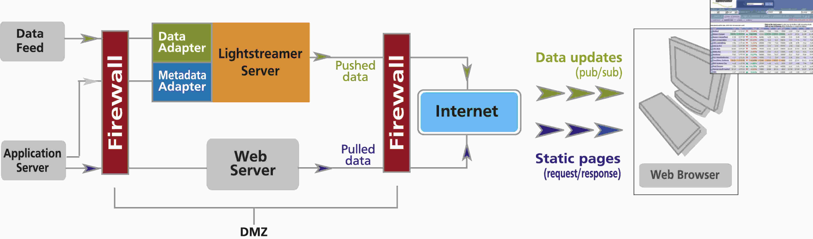

= Web Client Guide
Target API: Lightstreamer Web Client (Unified) v8.0.0
2019-10-18
:doctype: book
// Settings
// (see https://github.com/asciidoctor/asciidoctor-pdf/tree/master/examples
// and https://github.com/asciidoctor/asciidoctor-pdf/blob/master/docs/theming-guide.adoc)
//:experimental:
//:reproducible:
//:icons: font
//:listing-caption: Listing
:sectnums:
:toc:
:toclevels: 3
ifdef::backend-pdf[]
:title-logo-image: 
// Syntax highlighter (https://asciidoctor.org/docs/user-manual/#rouge)
:source-highlighter: rouge
endif::[]

== Introduction

This document provides a conceptual introduction to the development of
Lightstreamer Clients based on the Web Client Library.

A full https://lightstreamer.com/api/ls-web-client/latest/[JavaScript API reference] is available online.

== Web Client Development

The **Lightstreamer Web Client API** is a set of *JavaScript*
classes that can be included into any Web site, HTML5
application, or JavaScript application in general in order to make it
"Lightstreamer-enabled", that is, ready to receive and send real-time
data from/to Lightstreamer Server.

The Web Client Library supports all the major formats (UMD, CommonJS and ES modules)
and bundlers (Webpack, Rollup and Browserify). Further information on how
to integrate the library in a project is provided on the https://www.npmjs.com/package/lightstreamer-client-web[npm library page].
It is also possible to customize the library to only
include the desired classes by means of a build script distributed with the
https://github.com/Lightstreamer/Lightstreamer-lib-client-javascript[Github project].

=== Deployment Architecture

For demo purpose, Lightstreamer Server contains an internal web server
that is able to serve static web resources. This makes it simple to
distribute out-of-the-box demos (such as the https://github.com/Lightstreamer/Lightstreamer-example-StockList-client-javascript#basic-stock-list-demo---html-client[Stock-List Demo]) and to get
started with Lightstreamer development. But for actual projects and
production scenarios, it is highly recommended that an external web
server is used (because Lightstreamer is optimized for pushing real-time
data, not for serving static pages).

Typically, a Lightstreamer Server and any common web server (e.g.
Apache, nginx, IIS or any other web server of your choice) are deployed
in the DMZ network. Lightstreamer Server gets the data and metadata from
the back-end servers that are protected by the second firewall. The web
browser gets the static web pages, as usual, from your web server, then
it connects to Lightstreamer Server to receive the flow of real-time
updates. Of course, both servers can be clustered for fail-over and load
balancing.

It is also possible to let a browser load the static web pages directly
from the file system of the client machine, a case that is useful during
development and testing.

=== Site/Application Architecture

Each page of the site that is going to receive and/or send real-time
updates from/to Lightstreamer Server must include a https://lightstreamer.com/api/ls-web-client/latest/LightstreamerClient.html[LightstreamerClient] instance, which transparently manages the connections to Lightstreamer Server.

The library is designed to work even outside of a
browser context. This means you can use it within any JavaScript-based
environment, including *PhoneGap*, *SmartTV*, and others. For the
*Node.js* environment, a similar, specialized library is made available
as a different SDK (see the https://www.npmjs.com/package/lightstreamer-client-node[npm page] for details).

=== The LightstreamerClient

An HTML page, produced through any kind of server technology (e.g. JSP,
ASP, PHP, Node.js, etc.) can host a https://lightstreamer.com/api/ls-web-client/latest/LightstreamerClient.html[LightstreamerClient] to connect to a
Lightstreamer Server.

Below are the steps required to transform a normal HTML page into an
HTML page receiving updates from a https://lightstreamer.com/api/ls-web-client/latest/LightstreamerClient.html[LightstreamerClient]. (The code
examples assume that the https://www.npmjs.com/package/lightstreamer-client-web#global-objects[UMD variant] of the library is deployed under the "/js" folder of the web server).

=== Basic Example

.  **Include the libraries**
As a very first action, the HTML page should import, in its HEAD
section, the *lightstreamer.js* JavaScript library.
+
[source, html]
----

----

.  **Include the style sheets**
All the *cascading style sheets* (*CSS*) declared in the Lightstreamer
functions should be defined or linked in the HEAD section of the page.

.  **Create the LightstreamerClient object**
To connect to a Lightstreamer Server, a https://lightstreamer.com/api/ls-web-client/latest/LightstreamerClient.html[LightstreamerClient] object
has to be created, configured, and instructed to connect to the
Lightstreamer Server.
A minimal version of the code that creates a https://lightstreamer.com/api/ls-web-client/latest/LightstreamerClient.html[LightstreamerClient] and
connects to the Lightstreamer Server on http://push.mycompany.com will
look like this:
+
[source, javascript]
----
var myClient = new LightstreamerClient("http://push.mycompany.com","MyAdapterSet");
myClient.connect();
----

.  *Create a Subscription object*
A simple https://lightstreamer.com/api/ls-web-client/latest/Subscription.html[Subscription] containing three items and
three fields to be subscribed in MERGE mode is easily created (see
https://www.lightstreamer.com/docs/base/General%20Concepts.pdf[Lightstreamer General Concepts]):
+
[source, javascript]
----
var mySubscription = new Subscription("MERGE",["item1","item2","item3"],["field1","field2","field3"]);
mySubscription.setDataAdapter("MyDataAdapter");
myClient.subscribe(mySubscription);
----

.  *Listen for real-time updates*
Before sending the subscription to the server, usually at least one
listener is attached to the https://lightstreamer.com/api/ls-web-client/latest/Subscription.html[Subscription] instance in order to consume
the real-time updates. The following code shows the value of the
"field1" field in a JavaScript alert each time a new update is received
for the subscription:
+
[source, javascript]
----
mySubscription.addListener({
    onItemUpdate: function(updateObject) {
        alert(updateObject.getValue("field1"));
    }
});
----

.  **The complete code**
Below is the complete JavaScript code:
+
[source, javascript]
----
var myClient = new LightstreamerClient("http://push.mycompany.com", "MyAdapterSet");
myClient.connect();
var mySubscription = new Subscription("MERGE",["item1","item2","item3"],["field1","field2","field3"]);
mySubscription.setDataAdapter("MyDataAdapter");
mySubscription.addListener({
    onItemUpdate: function(updateObject) {
        alert(updateObject.getValue("field1"));
    }
});
myClient.subscribe(mySubscription);
----

==== LightstreamerClient in a Web Worker

A https://lightstreamer.com/api/ls-web-client/latest/LightstreamerClient.html[LightstreamerClient] instance can also be used inside a https://developer.mozilla.org/en-US/docs/Web/API/Web_Workers_API[WebWorker]. 

.  **Create a Worker**
To load the client in a Worker, a Worker is needed first. A listener on
the worker can be used to receive messages from the worker itself.
Simply put the following code in a HTML file
+
[source, javascript]
----

----

.  **Prepare the Worker Code**
The _index.js_ file specified in the above code will contain the
JavaScript code used to connect to a Lightstreamer Sever. It starts
including the needed library
+
[source, javascript]
----
importScripts("lightstreamer.js");
----
then the same code shown in the above example can be used with only one single difference, that is, a
different approach is used to consume the https://lightstreamer.com/api/ls-web-client/latest/Subscription.html[Subscription] data: such data
is sent back as an event using the postMessage facility (note that the
alert method is not even available in the Worker context):
+
[source, javascript]
----
mySubscription.addListener({
    onItemUpdate: function(updateObject) {
        postMessage(updateObject.getValue("field1"));
    }
});
----

=== Simple Widgets

The Lightstreamer Web Client Library includes some ready-made widgets, under the form of https://lightstreamer.com/api/ls-web-client/latest/SubscriptionListener.html[SubscriptionListener] implementations that can be used in an HTML page to show the data received on a https://lightstreamer.com/api/ls-web-client/latest/Subscription.html[Subscription]. You can use these widgets to get started or you may want to directly use any third-party library to display the data.

Below is a description of the two main implementations: https://lightstreamer.com/api/ls-web-client/latest/StaticGrid.html[StaticGrid] and
https://lightstreamer.com/api/ls-web-client/latest/DynaGrid.html[DynaGrid]. Actually, such classes can also be used without listening on
https://lightstreamer.com/api/ls-web-client/latest/Subscription.html[Subscription] objects, but such usage is out of the scope of this
document.

In the following description the term *cell* is used to refer to the
atomic unity of visualization for data pushed by Lightstreamer and
associated to a *field* (see https://www.lightstreamer.com/docs/base/General%20Concepts.pdf[General Concepts]).

In order to declare a cell, a special *DIV* element or a special *SPAN*
element should be used. It is possible to choose between a DIV and a
SPAN tag for each cell, according to the front-end
requirements.footnote:[ See
http://www.w3.org/TR/REC-html40/struct/global.html#h-7.5.4 for a formal
specification of the difference between DIV and SPAN.] Alternative
ways for supplying push cells are available, which allow the use of any
kind of tag.

==== StaticGrid

In a https://lightstreamer.com/api/ls-web-client/latest/StaticGrid.html[StaticGrid] each cell is statically defined in the HTML page.

Each cell for this kind of grid can define the following special
properties:

* [mandatory] *data-source*: this special property must be specified
with its value being "lightstreamer" in order to authorize the
StaticGrid to use such HTML element as a cell.
* [mandatory] *data-grid*: an identifier that is used to associate a
cell with a StaticGrid instance: the same value has to be specified in
the constructor of the StaticGrid.
* [mandatory] *data-row*: a number representing the row number this cell
is associated with. As all the cells have to be manually defined, the
number of rows in the grid is defined by the biggest value of this
property in all the cells related to the StaticGrid (note that
*data-item* can be used instead of data-row in some special cases).
* [mandatory] *data-field*: the name of the field to be associated with
the cell (it can also be a field index)
* [optional] *data-num*: if there is the requirement to have more cells
related to the same row/field pair, it is possible to specify this
property in order to distinguish between such cells when handling the
StaticGrid events.
* [optional] *data-update*: by default the content of a cell is
updated with the received values. By specifying this property, it is
possible to target any property of the HTML element (e.g.: the src
property of an IMG tag) or its stylesheet.
* [optional] *data-fieldtype* The StaticGrid class offers the
_extractFieldList_ and _extractCommandSecondLevelFieldList_ functions to
read from the html the data-field values of the associated cells. Using
this property is possible to specify if a field has to be extracted
during _extractFieldList_ executions (missing data-fieldtype property or
"first-level" value), during _extractCommandSecondLevelFieldList_
(data-fieldtype set to "second-level") or neither (data-fieldtype set to
"extra")

Example (HTML part)

[source, html]
----

-

-

-

-

----

Example (JavaScript part)

[source, javascript]
----
new StaticGrid("quotes",true);
----

Only the basic bits of the StaticGrid are described in this guide; check
out the JSDoc for all the details.

==== DynaGrid

In a https://lightstreamer.com/api/ls-web-client/latest/DynaGrid.html[DynaGrid] only one row of cells is defined in the HTML page (the
*template*). New rows are then cloned from the given template row. The
template row will be associated to the DynaGrid instance via its *id*
property and will contain all of the necessary cells. The data-source
property of this template has to be configured as if it was a cell.

Each cell for this kind of grid can define the following special
properties:

* [mandatory] *data-source*: this special property must be specified
with its value being "lightstreamer" in order to authorize the DynaGrid
to use such HTML element as a cell.
* [mandatory] *data-field*: the name of the field to be associated
with the cell (it can also be a field index)
* [optional] *data-num*: if there is the requirement to have more cells
related to the same field, it is possible to specify this property in
order to distinguish between such cells when handling the DynaGrid
events.
* [optional] *data-update*: by default the content of a cell is
updated with the received values. By specifying this property it is
possible to target any property of the HTML element (e.g.: the src
property of an IMG tag) or its stylesheet.
* [optional] *data-fieldtype*: the DynaGrid class offers the
_extractFieldList_ and _extractCommandSecondLevelFieldList_ functions to
read from the html the data-field values of the associated cells. Using
this property is possible to specify if a field has to be extracted
during _extractFieldList_ executions (missing data-fieldtype property or
"first-level" value), during _extractCommandSecondLevelFieldList_
(data-fieldtype set to "second-level") or neither (data-fieldtype set to
"extra")

Example (HTML part)

[source, html]
----

    
-

    
-

----

Example (JavaScript part)

[source, javascript]
----
new DynaGrid("quotes",true);
----

=== Troubleshooting

During development it is always possible to encounter issues preventing
custom code from working as expected. If that happens you can follow the
tips in this section to solve the issues.

==== Check for exceptions

The first thing to look at when facing an issue is the console of the
browser in use. Most modern browsers offer some sort of built-in
JavaScript console: fire it up and reload your application; if there is
a piece of code throwing an exception it will be likely shown there.

==== Server-sent errors

When connecting to a server, subscribing to an item or sending a
message, something can go wrong due to bad configurations, adapter errors
or server constraints. In these cases the server will send back an error
that will be exposed on the appropriate listener(s). You can register a
listener on your objects to receive such notifications:

- *Connection errors* A https://lightstreamer.com/api/ls-web-client/latest/ClientListener.html[ClientListener] instance can be used to receive error notifications on https://lightstreamer.com/api/ls-web-client/latest/LightstreamerClient.html[LightstreamerClient] instances. Note that the https://lightstreamer.com/api/ls-web-client/latest/ClientListener.html[ClientListener] interface has some methods other than the error one that we're going to see now.

[source, javascript]
----
var myLSClient = new LightstreamerClient();
myLSClient.addListener({
    onServerError: function(errorCode,errorMessage) {
        // here you can consume the error
    }
});
----

- *Subscription errors* A https://lightstreamer.com/api/ls-web-client/latest/SubscriptionListener.html[SubscriptionListener] instance can be used to receive error notifications regarding a https://lightstreamer.com/api/ls-web-client/latest/Subscription.html[Subscription]. Note that the https://lightstreamer.com/api/ls-web-client/latest/SubscriptionListener.html[SubscriptionListener] interface has some methods other than the error ones that we're going to see now.

[source, javascript]
----
var mySubscription = new Subscription();
mySubscription.addListener({
    onSubscriptionError: function(errorCode,errorMessage) { 
        //here you can consume the error
    },
    onCommandSecondLevelSubscriptionError: function(errorCode,errorMessage,relatedkey) {
        //this one can only be fired in case a two-level subscription is created
        //here you can consume the error
    }
});
----

- *Message errors* A https://lightstreamer.com/api/ls-web-client/latest/ClientMessageListener.html[ClientMessageListener] instance can be used to receive error notifications on sent messages. Note that the https://lightstreamer.com/api/ls-web-client/latest/ClientMessageListener.html[ClientMessageListener] interface has some methods other than the error one that we're going to see now.

[source, javascript]
----
myLSClient.sendMessage(myMessage,mySequence,myTimeout,{
    onError: function(myMessage) {
        //here you can consume the error
    },
    onDeny: function(myMessage,denyCode,denyMessage) {
        //here you can consume the error
    }
});
----

==== Logging

The Lightstreamer Web Client API includes a simple
https://lightstreamer.com/api/ls-web-client/latest/LoggerProvider.html[LoggerProvider] logging interface that can be implemented to consume log
messages from within the library.

A ready-made implementation of such interface, together with several log
appender classes, is distributed with the library. The configuration of
this logging facility should be different between development and
production environments.

The suggested approach is to use a https://lightstreamer.com/api/ls-web-client/latest/ConsoleAppender.html[ConsoleAppender] configured at INFO
level during development and a https://lightstreamer.com/api/ls-web-client/latest/RemoteAppender.html[RemoteAppender] configured at ERROR level
or no appenders at all on production deployments.

The log messages are also identified by a category.

- **Development setup** During development we suggest to setup a https://lightstreamer.com/api/ls-web-client/latest/ConsoleAppender.html[ConsoleAppender] at INFO level to keep an eye on what is happening on the library. 
Most modern desktop browsers include (or can be extended with) a console showing the
messages produced by such appender (for instance, look for the Developer
Tools). 

[source, javascript]
----
var loggerProvider = new SimpleLoggerProvider();
LightstreamerClient.setLoggerProvider(loggerProvider);
var myAppender = new ConsoleAppender("INFO","*");
loggerProvider.addLoggerAppender(myAppender);
----

- **Production setup** During production we suggest to remove the https://lightstreamer.com/api/ls-web-client/latest/ConsoleAppender.html[ConsoleAppender] and add a https://lightstreamer.com/api/ls-web-client/latest/RemoteAppender.html[RemoteAppender] that will forward its messages to the configured Lightstreamer Server.
To setup such logging the following code can be used (where myClient is the instance of https://lightstreamer.com/api/ls-web-client/latest/LightstreamerClient.html[LightstreamerClient] connected to the server where the logging has to be sent):

[source, javascript]
----
var loggerProvider = new SimpleLoggerProvider();
LightstreamerClient.setLoggerProvider(loggerProvider);
var myAppender = new RemoteAppender("ERROR","*",myClient);
loggerProvider.addLoggerAppender(myAppender);
----

==== Still in trouble

If none of the above suggestions made you find a solution to your
problems you can reach out to http://forums.lightstreamer.com/[our
public forums].

